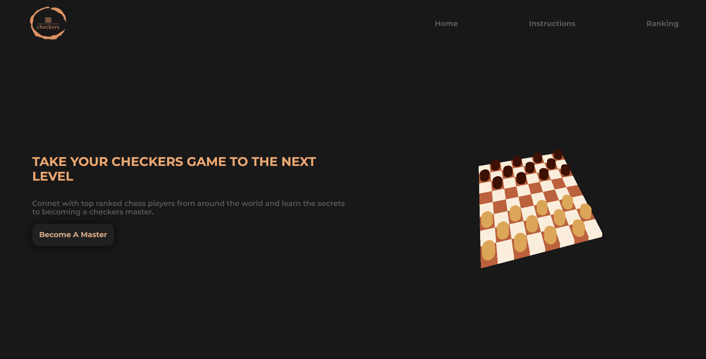

# Juego Damas
¡Bienvenido a Mi Aplicación!

## Instalación
Para ejecutar esta aplicación en tu máquina local, sigue estos pasos:

1. Clona este repositorio en tu máquina local usando `git clone`.
2. Ve al directorio del proyecto usando `cd mi-aplicacion-de-react`.
3. Instala las dependencias usando `npm install`.
4. Inicia la aplicación usando `npm start`.

## Estructura del proyecto
- `Backend/ :` Contiene la logica de creacion de APIs , conección con la base de datos , seguridad de usuario.
- `public/`: Contiene archivos estáticos y el archivo HTML principal.
- `src/`: Contiene el código fuente de la aplicación.
  - `components/`: Componentes de React reutilizables.
  - `App.js`: Componente principal que define la estructura de la aplicación.
  - `index.js`: Punto de entrada de la aplicación.
- `package.json`: Archivo de configuración de npm que contiene las dependencias del proyecto y los scripts de inicio y compilación.

## Contribución
¡Estamos abiertos a contribuciones! Si deseas contribuir a este proyecto, por favor sigue estos pasos:
1. Haz un fork de este repositorio.
2. Crea una nueva rama para tus cambios (`git checkout -b feature/nueva-caracteristica`).
3. Haz tus cambios y realiza los commits (`git commit -am 'Agrega nueva característica'`).
4. Haz push a la rama (`git push origin feature/nueva-caracteristica`).
5. Abre una solicitud de extracción en GitHub.

## Licencia
Este proyecto está bajo la Licencia [Tipo de licencia]. Para más detalles, ver el archivo LICENSE.md.

## Contacto
Si tienes alguna pregunta o sugerencia, por favor contáctanos en [correo electrónico] o abre un issue en este repositorio.

## Diseño
